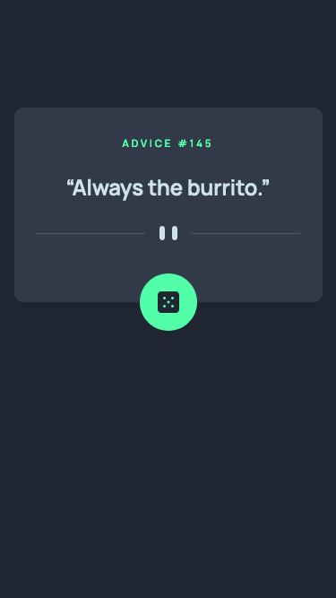

# Frontend Mentor - Advice generator app solution

This is a solution to the [Advice generator app challenge on Frontend Mentor](https://www.frontendmentor.io/challenges/advice-generator-app-QdUG-13db). Frontend Mentor challenges help you improve your coding skills by building realistic projects.

## Table of contents

- [Overview](#overview)
  - [The challenge](#the-challenge)
  - [Screenshot](#screenshot)
  - [Links](#links)
- [My process](#my-process)
  - [Built with](#built-with)
  - [What I learned](#what-i-learned)
  - [Continued development](#continued-development)

## Overview

### The challenge

Users should be able to:

- Click the button to generate a new advice
- Have the screen-reader read the new advice when it is fetched (when voiceover is activated)

### Screenshot

### Links

- Solution URL: https://github.com/owi92/advice-generator-app
- Live Site URL: https://owi92.github.io/advice-generator-app/

## My process

### Built with

- angular
- basic html & css

### What I learned

I learned a little more about accessibility and how to implement angular's live announcer to announce the updated advice on button-press. Aria-live did not work in this project, but I could not figure out why.

### Continued development

I want to focus on and learn more about unit testing, as well as deepen my knowledge about how to create accessible websites/components.
